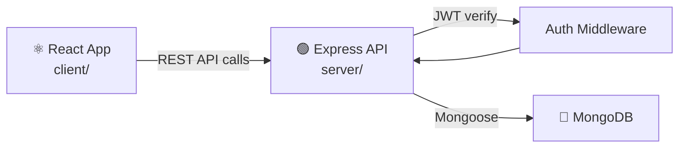

# Full-Stack React + Node.js Email Dashboard

<p align="center">
  
  
  
  
  
  
</p>

A **full-stack email management dashboard** — React frontend with a Node.js/Express REST API backend and MongoDB. Features JWT-authenticated login, and an inbox for sending, forwarding, and listing messages.

---

## ✨ Features

- 🔐 **JWT Authentication** — secure login with token-based sessions
- 📧 **Email Dashboard** — send, forward, and list messages
- 🗄️ **MongoDB** — Mongoose ODM for message and user persistence
- ⚛️ **React frontend** — component-based UI with client-side routing

---

## 🏗️ Architecture



---

## 🚀 Quick Start

```bash
git clone https://github.com/ahmadalsharef994/Fullstack_React_Node_Login_Dashboard.git
cd Fullstack_React_Node_Login_Dashboard
```

### Start the backend
```bash
cd server
npm install
npm start        # http://localhost:5000
```

### Start the frontend
```bash
cd client
npm install
npm start        # http://localhost:3000
```

Make sure MongoDB is running locally (`mongod`).

---

## 📁 Structure

```
├── client/          # React app
│   ├── src/
│   │   ├── components/
│   │   └── App.js
└── server/          # Express API
    ├── routes/
    ├── models/
    └── index.js
```

---

## 📄 License

MIT
